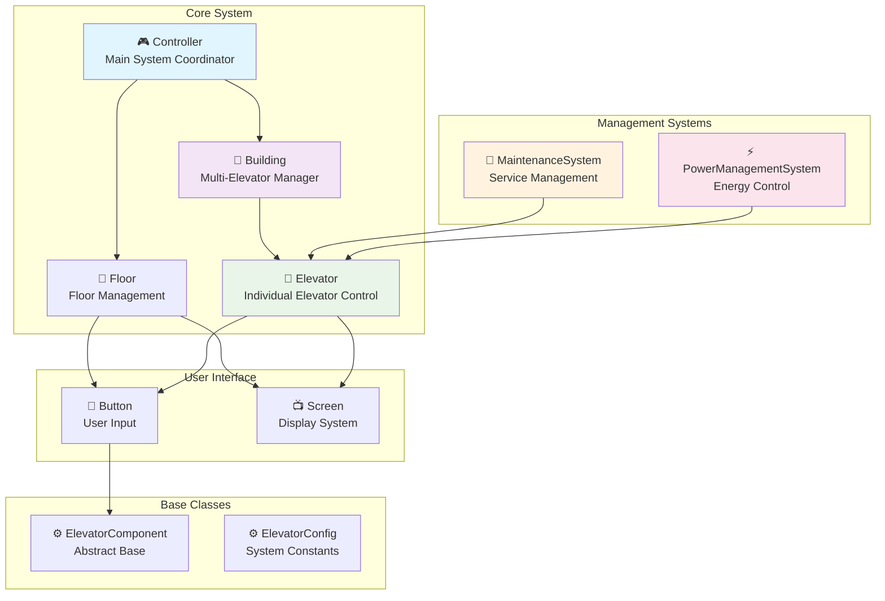
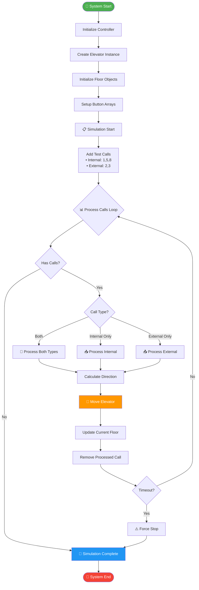
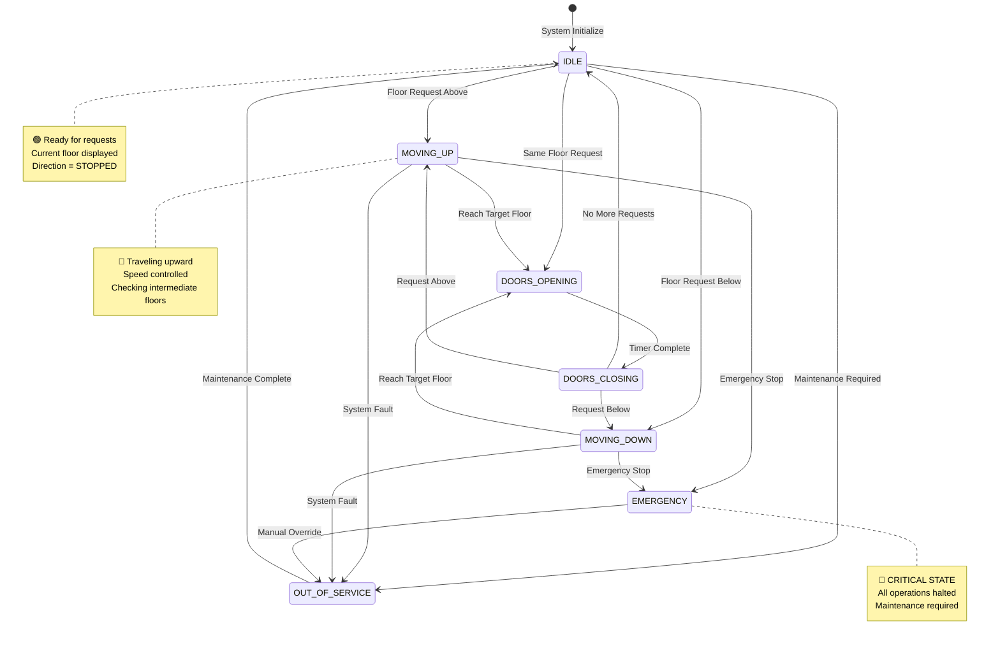
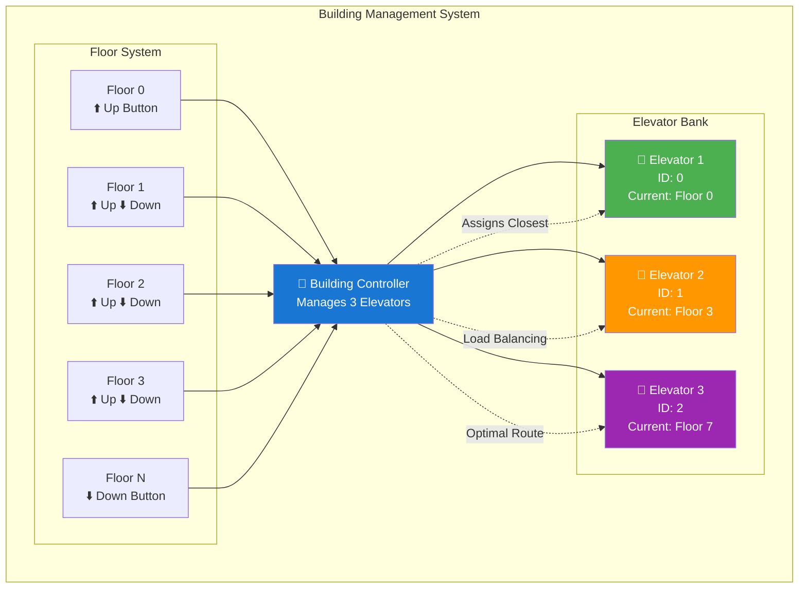
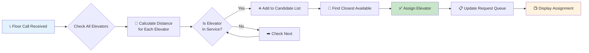
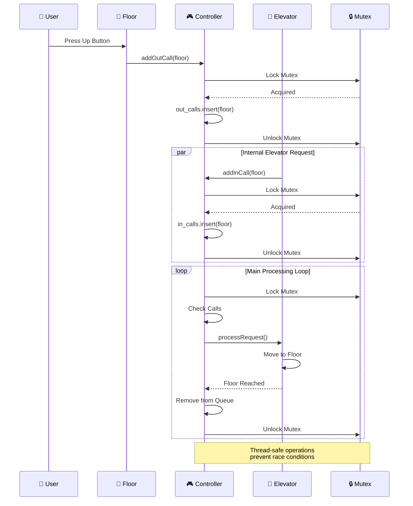
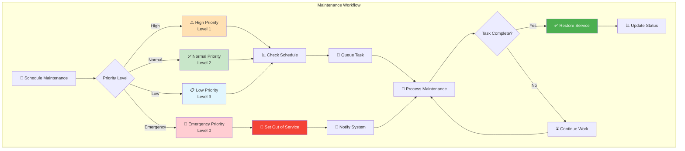
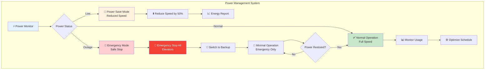
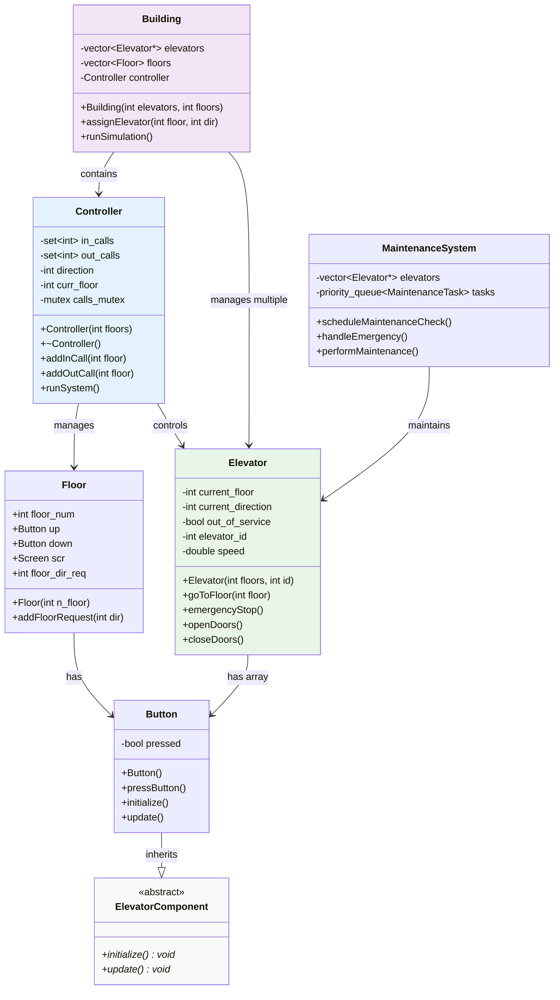

# 🏢 Elevator Controller System - Technical Documentation

<div align="center">


*A sophisticated, thread-safe elevator control system with advanced scheduling and maintenance features*

</div>

---

## 📋 Table of Contents

- [🏗️ System Architecture](#️-system-architecture)
- [🔄 System Flow](#-system-flow)
- [🚗 Elevator State Machine](#-elevator-state-machine)
- [🏢 Multi-Elevator Building Management](#-multi-elevator-building-management)
- [⚡ Component Interactions](#-component-interactions)
- [🛠️ Maintenance System Flow](#️-maintenance-system-flow)
- [🔌 Power Management](#-power-management)
- [📊 Class Relationships](#-class-relationships)
- [🚀 Getting Started](#-getting-started)
- [🔧 Configuration](#-configuration)

---

## 🏗️ System Architecture

The elevator controller system follows a modular, object-oriented design with clear separation of concerns:



---

## 🔄 System Flow

### Main Operation Flow



---

## 🚗 Elevator State Machine



---

## 🏢 Multi-Elevator Building Management



### Elevator Assignment Algorithm



---

## ⚡ Component Interactions

### Thread-Safe Call Management



---

## 🛠️ Maintenance System Flow



---

## 🔌 Power Management



---

## 📊 Class Relationships



---

## 🚀 Getting Started

### Quick Setup

```bash
# Clone the repository
git clone https://github.com/yourusername/elevator-controller.git
cd elevator-controller

# Compile the system
g++ -std=c++11 -pthread -o elevator_controller *.cpp

# Run the simulation
./elevator_controller
```

### Example Output

```
---------------------------
Elevator Controller created
---------------------------
Button pressed
Button pressed
Button pressed
Button pressed
Button pressed
Elevator 0 going to floor: #1
Current elevator floor is: 1
Elevator 0 going to floor: #2
Current elevator floor is: 2
...
Simulation completed: All requests processed
```

---

## 🔧 Configuration

### System Parameters (ElevatorConfig.h)

| Parameter | Default | Description |
|-----------|---------|-------------|
| `DEFAULT_FLOORS` | 8 | Number of floors in building |
| `MAX_ELEVATORS` | 10 | Maximum elevators per building |
| `DEFAULT_SPEED` | 1.0 | Floors per second |
| `MAX_SPEED` | 3.0 | Maximum elevator speed |
| `DOOR_OPERATION_TIME` | 2000ms | Time for door operations |
| `MAX_SIMULATION_CYCLES` | 100 | Safety limit for simulation |

### Customization Example

```cpp
// Create a 20-floor building with 4 elevators
Building skyscraper(4, 20);

// Configure high-speed elevator
Elevator express(20, 1);
express.setSpeed(ElevatorConfig::MAX_SPEED);

// Run custom simulation
skyscraper.runSimulation();
```

---

## 🌟 Features Highlight

<div align="center">

| Feature | Status | Description |
|---------|--------|-------------|
| 🔒 **Thread Safety** | ✅ | Mutex-protected shared resources |
| 🚗 **Multi-Elevator** | ✅ | Support for multiple elevators |
| 🛠️ **Maintenance** | ✅ | Automated maintenance scheduling |
| ⚡ **Power Management** | ✅ | Energy-efficient operation modes |
| 🎯 **Smart Scheduling** | ✅ | Optimized elevator assignment |
| 🛡️ **Safety Features** | ✅ | Emergency stops and failsafes |
| 📊 **Real-time Status** | ✅ | Live system monitoring |
| ⚙️ **Configurable** | ✅ | Customizable system parameters |

</div>

---

<div align="center">

**🏢 Built with precision for modern elevator systems**

[](https://github.com/yourusername/elevator-controller)
[](https://github.com/yourusername/elevator-controller/fork)

*Elevator Controller System - Making vertical transportation intelligent* 🚀

</div> 